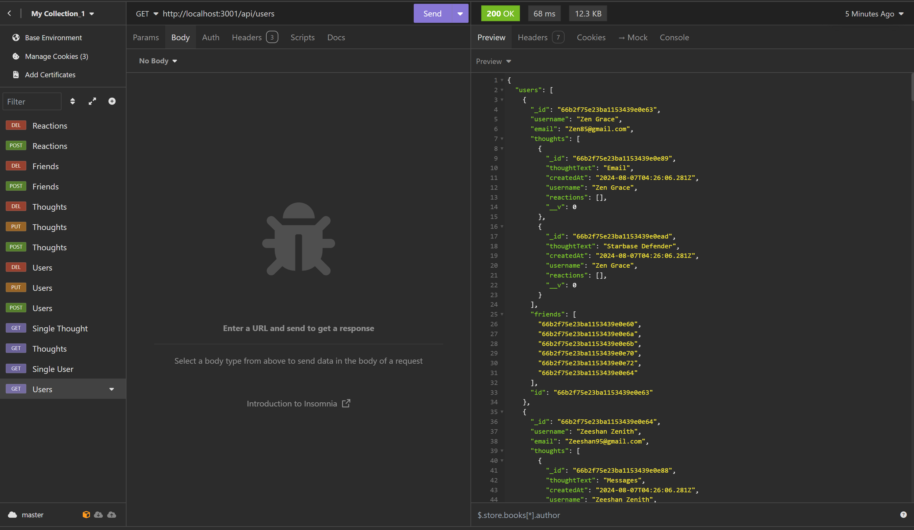
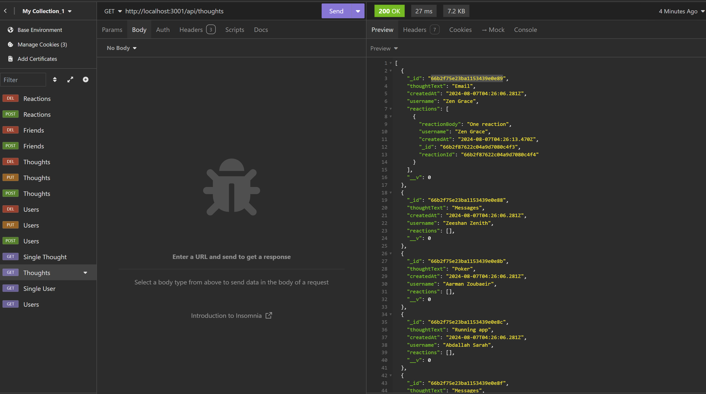

# API for social Media
  
  ## Description

  This is an API for a social network web application where users can share their thoughts, react to friends’ thoughts, and create a friend list.

  ## Screenshots 
  
  

  Link of walktrhough video : https://drive.google.com/file/d/1oIsDrJgb21SaRvL7DQ7dIlDXUQ2BpnmW/view

  ## Questions

  My email : yordanopv@gmail.com
  
  My Github page : https://github.com/yordanop

  ## Table of Contents

- [Installation](#installation)
- [Usage](#usage)
- [Credits](#credits)
- [License](#license)

## Installation

run 

  > npm i 

 then run 

  > npm start 
  
now you can interact with the API

## Credits

Thanks to my instructors in especial for Britani

## License

   [MIT](https://choosealicense.com/licenses/mit/)

## Features

really cool API

  